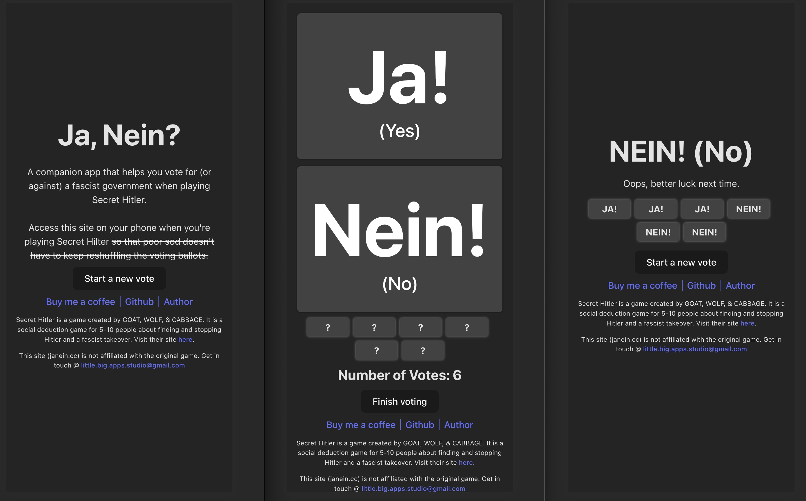

# Ja / Nein - companion voting app for Secret Hitler

https://www.janein.cc

A companion app that helps you vote for (or against) a fascist
government when playing Secret Hitler.

# How to use

1. Nominate someone's phone
2. Load the site https://www.janein.cc on said phone
3. Press "Start a new vote"
4. Vote.
5. Once a person is done voting, pass the phone ontoto the next person.
6. Repeat step 4-5 until everyone has voted.
7. Press "Finish voting" and get your results.



# Development

```bash
yarn # installs the thing
yarn dev # run it locally on http://localhost:5173/
```

# Contributions

Just chuck a PR / Issue and I'll have a look at it. I promise I won't be a fascist about it.

# Privacy Policy

We don't collect any data other than page visits. Can't be bothered tbh.
